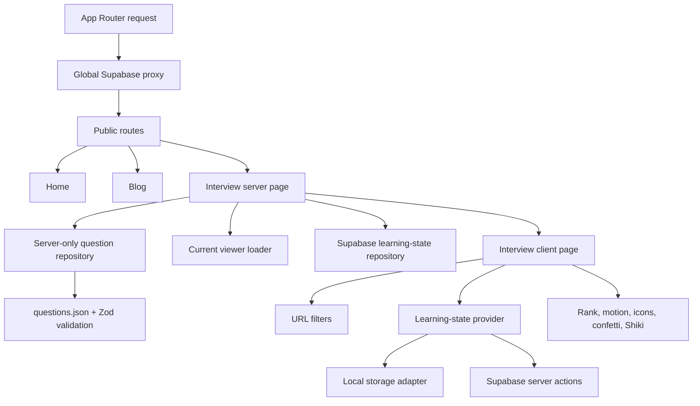
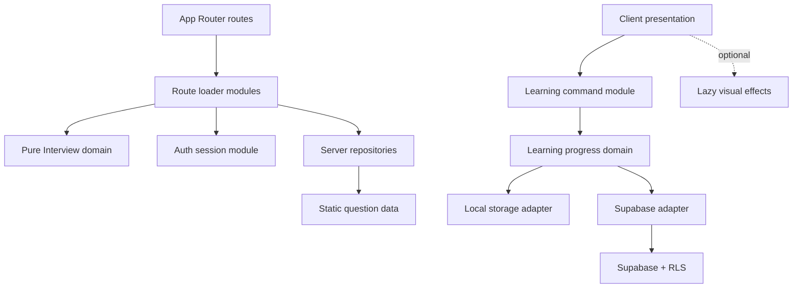

# Codebase Quality and Architecture Audit

**Repository:** `vodinhquan.v1`
**Audit date:** 2026-06-14
**Commit:** `06a9f8e`
**Initial verdict:** Request changes before treating the authenticated Interview Practice flow as production-ready.
**Refactor status:** The source-level blockers were remediated on 2026-06-14. Deployment remains gated on applying and validating `202606140001_secure_learning_progress.sql` against the hosted Supabase project.

## 1. Executive Summary

The repository has a sound high-level direction:

- Next.js App Router is used consistently.
- The Interview question bank is owned by a dedicated feature folder.
- Raw question JSON stays behind a `server-only` repository.
- Question data is runtime-validated with Zod.
- URL state is explicit and shareable.
- Supabase tables use row-level security.
- The production build and TypeScript compilation pass.
- No source import cycles were detected.

The current release still has three blockers:

1. `pnpm audit --prod` reports 32 vulnerability instances, including 13 high-severity findings. The direct `next@16.1.1` dependency is affected by multiple advisories with fixes requiring at least `16.2.6`.
2. Browser-to-account synchronization can overwrite existing remote learned, bookmarked, and pinned state while the client temporarily displays a merged result.
3. The implementation accepts every authenticated GitHub user, while the project instructions define future authentication as owner-only. This must become an explicit product and authorization decision.

The absence of automated tests is a major force multiplier for these risks. The most important flows currently rely on optimistic state, server actions, RLS, local storage, and merge behavior without regression coverage.

### Initial Quality Score

| Axis | Score | Summary |
| --- | ---: | --- |
| Correctness | 5/10 | Core browsing works, but sync and flashcard state have reproducible failure modes. |
| Readability | 6/10 | Naming is generally clear; several client modules carry too many responsibilities. |
| Architecture | 6/10 | Good feature ownership and server data seam; learning state and auth concerns remain spread across modules. |
| Security | 3/10 | RLS is solid, but vulnerable dependencies and redirect-origin trust require action. |
| Performance | 5/10 | Server filtering is appropriate; global auth proxying and the Interview client bundle are expensive. |
| Testability | 2/10 | Pure helpers exist, but there are no tests, test runner, or CI quality gate. |

## 2. Scope and Method

The audit covered:

- `src/app`
- `src/components`
- `src/features`
- `src/lib`
- `supabase/migrations`
- project configuration, package metadata, and generated production output

The review used five axes:

1. Correctness
2. Readability and simplicity
3. Architecture
4. Security
5. Performance

The QRTable-specific rules in `clean-code-ts` were not applied literally because this repository is a personal Next.js site, not the QRTable Nx/NestJS monorepo. Its general TypeScript, Next.js, progressive-improvement, and evidence-first standards were applied. The existing repository remains the source of truth.

## 3. CodeGraph Snapshot

After synchronization:

| Metric | Value |
| --- | ---: |
| Indexed files | 146 |
| Nodes | 1,164 |
| Edges | 1,998 |
| Import edges | 425 |
| Call edges | 374 |
| Reference edges | 177 |

Important graph observations:

- `cn` is the highest in-degree source symbol with 111 incoming edges.
- `createInterviewHref` has 16 incoming edges and is the central URL-state interface.
- `createSupabaseServerClient` affects 22 symbols across auth, server actions, repositories, and the Interview route.
- `InterviewLearningStateProvider` has 22 outgoing edges and is the main correctness hotspot.
- `interview-practice-page.tsx` has 59 outgoing edges.
- `tech-icon.tsx` has 86 outgoing edges because every icon implementation is statically imported.
- No source import cycle was detected across 135 TypeScript/TSX files.

## 4. Current Architecture



The strongest existing seam is the server-only question repository. The weakest seam is learning state: its interface includes optimistic UI behavior, persistence choice, synchronization, rollback, local storage events, and server action error handling.

## 5. Findings

### Blockers

#### BLOCK-001: Production dependency graph contains known high-severity vulnerabilities

**Files:** `package.json:17-49`, `pnpm-lock.yaml`
**Evidence:** `pnpm audit --prod`

The clean, frozen dependency installation reports:

- 32 vulnerability instances
- 13 high
- 16 moderate
- 3 low
- 31 advisories across `next`, `serialize-javascript`, `picomatch`, `yaml`, `defu`, `postcss`, `uuid`, and `esbuild`

The direct dependency `next@16.1.1` is affected by multiple App Router, Server Component, Middleware/Proxy, SSRF, cache, and denial-of-service advisories. The highest patched threshold reported by the audit is `next >= 16.2.6`.

Transitive findings come primarily through the Content Collections toolchain.

**Required action:**

1. Upgrade `next` and `eslint-config-next` together to a compatible release at or above `16.2.6`.
2. Upgrade the Content Collections packages and verify that patched transitive versions are selected.
3. Re-run `pnpm audit --prod`, `pnpm lint`, and `pnpm build`.
4. Record any remaining advisories with an applicability assessment instead of accepting them silently.

#### BLOCK-002: Local-to-account sync can destroy existing remote progress

**Files:**

- `src/features/interview-practice/actions/learning-state-actions.ts:125`
- `src/features/interview-practice/components/interview-learning-state-provider.tsx:203`

`syncLocalLearningState` constructs rows only from local state and upserts both state columns:

- A locally learned question writes `bookmarked_at: null`, potentially deleting an existing remote bookmark.
- A locally bookmarked question writes `learned_at: null`, potentially deleting existing remote learned state.
- `pinned_categories` is replaced with the local array instead of merged with remote categories.

The client then unions remote and local sets in memory, so the UI appears correct until reload. After reload, the overwritten database state becomes visible.

**Required action:**

- Make synchronization additive by contract.
- Merge on the server using current persisted state, or use a transactional Postgres function/RPC.
- Never write `null` for a state the local snapshot does not own.
- Merge pinned categories before persistence.
- Return the canonical merged snapshot from the server and replace client state with that snapshot.
- Add integration tests for every remote/local state combination.

#### BLOCK-003: Authentication scope conflicts with the documented owner-only direction

**Files:**

- `AGENTS.md:13`
- `AGENTS.md:421`
- `src/app/auth/sign-in/github/route.ts:17`
- `supabase/migrations/202606110001_interview_progress.sql:116`

The code permits any GitHub account to sign in and own progress rows. The repository instructions state that future authentication is for the owner, not a general user system.

This is not merely naming drift. It changes:

- authorization policy,
- data ownership,
- privacy expectations,
- migration strategy,
- support and abuse surface,
- whether multi-user persistence is an intended product capability.

**Required decision:**

- Owner-only: enforce an allowlist at authentication completion and in authorization-sensitive server modules, then reflect it in RLS or account provisioning.
- Multi-user: update the project context and architecture documentation to explicitly accept public user accounts.

Do not leave this implicit.

### High Priority

#### HIGH-001: State updater functions contain side effects

**File:** `src/features/interview-practice/components/interview-learning-state-provider.tsx:100`

The `setLearnedIds`, `setBookmarkedIds`, and `setPinnedCategoriesState` updater callbacks:

- call `startTransition`,
- invoke server actions,
- write local storage,
- schedule rollback state changes.

React requires updater functions to be pure and may invoke them twice in Strict Mode. Context7 documentation for React confirms both constraints.

**Risk:**

- duplicate server requests in development,
- behavior coupled to React scheduling,
- fragile rollback when rapid actions overlap,
- persistence logic that is difficult to test independently.

**Recommendation:**

Compute the next state in the event handler, update state optimistically, and perform persistence after the updater returns. Track per-question mutation versions or serialize mutations so stale responses cannot roll back newer user intent. Consider `useOptimistic` only after persistence commands have a clear contract.

#### HIGH-002: Server action input is not validated at the trust seam

**Files:**

- `src/features/interview-practice/actions/learning-state-actions.ts:5`
- `supabase/migrations/202606110001_interview_progress.sql:23`

Client-provided question IDs and category names reach the database without runtime validation. RLS prevents cross-user access, but it does not protect domain integrity.

Current database constraints allow:

- unknown question IDs,
- non-positive question IDs,
- arbitrary pinned category strings,
- unbounded array lengths.

**Recommendation:**

- Validate server action commands with Zod.
- Verify question IDs against the server-only question catalog.
- Verify categories against the canonical taxonomy.
- Add database checks where stable, such as `question_id > 0`.
- Put limits on bulk sync payload sizes.

#### HIGH-003: Repository read failures are converted into empty progress

**File:** `src/features/interview-practice/lib/learning-state-repository.ts:25`

The repository reads only `data` and ignores both Supabase errors. A network, RLS, or schema failure is returned to the UI as:

- zero learned questions,
- zero bookmarks,
- zero pinned categories,
- `isAuthenticated: true`.

This makes outages indistinguishable from valid empty state and can lead users to perform writes against a misleading snapshot.

**Recommendation:**

Use a discriminated result:

- success with canonical snapshot,
- unauthenticated,
- unavailable/error.

Render an explicit degraded state and log structured server-side diagnostics.

#### HIGH-004: No automated tests or CI quality gate exist

**Files:** `package.json:9`, repository root

There is:

- no test script,
- no unit test configuration,
- no browser/E2E test configuration,
- no test file,
- no CI workflow.

The repository contains high-risk behavior that needs coverage:

- merge semantics,
- optimistic rollback,
- RLS-backed server actions,
- URL normalization,
- question schema and metadata coverage,
- markdown formatting,
- flashcard state across filter changes.

**Recommendation:**

Add focused unit and integration coverage before broad refactoring. CI should run at least:

```bash
pnpm lint
pnpm test
pnpm build
pnpm audit --prod
```

#### HIGH-005: Flashcard index can become invalid after filters change

**File:** `src/features/interview-practice/components/flashcard-deck.tsx:24`

The deck preserves `index` while `questions` changes. If the user is on a later card and applies a filter that returns fewer questions, `questions[index]` becomes `undefined`. The UI then reports that no flashcards match even when the filtered array contains valid cards.

**Recommendation:**

Reset or clamp the index whenever the filtered question identity changes. Test transitions from a large result set to a smaller non-empty result set.

#### HIGH-006: Redirect origin trusts forwarded host and protocol values

**Files:**

- `src/app/auth/sign-in/github/route.ts:19`
- `src/app/auth/callback/route.ts:19`
- `src/app/auth/sign-out/route.ts:7`

The redirect origin is built directly from `x-forwarded-host` and `x-forwarded-proto`. This is deployment-dependent and can become a host-header poisoning or unintended redirect issue when the upstream proxy does not sanitize those headers.

**Recommendation:**

- Prefer a validated canonical application origin from configuration.
- Allow explicit localhost behavior in development.
- If forwarded headers must be used, validate them against an allowlist.
- Centralize `safeNextPath` and origin resolution in one server-only auth utility.

### Medium Priority

#### MEDIUM-001: Global proxy performs an auth network call for public pages

**Files:**

- `middleware.ts:9`
- `src/lib/supabase/proxy.ts:32`

The matcher covers nearly every non-static route and calls `supabase.auth.getUser()` for public Home, Blog, Open Graph, and Interview requests.

For `/interview`, the route then performs another cached user lookup plus profile, progress, and preference reads. Filter navigation therefore pays for authentication and persistence reads repeatedly.

**Recommendation:**

- Narrow the proxy matcher to routes that require session refresh.
- Avoid auth work for fully public routes that do not render viewer state.
- Consolidate Interview viewer and progress loading behind one server module.
- Measure request count and latency before and after the change.

#### MEDIUM-002: Interview client surface is heavy

**Evidence:**

- 13 referenced client chunks
- 792,389 raw bytes
- 259,796 gzip bytes
- approximately 153,858 gzip bytes unique to the Interview route versus Home and Blog
- largest localized category DTO measured at approximately 238 KB uncompressed

Contributors include:

- static import of the entire tech icon registry,
- `motion`,
- `canvas-confetti`,
- client-side Shiki,
- rank modal and 3D profile effects,
- all filtered answers serialized into the client tree.

**Recommendation:**

- Dynamically import celebration and rank-promotion visuals.
- Respect reduced-motion before loading confetti.
- Split icon groups or use a smaller registry interface.
- Move syntax highlighting to build/server time where practical.
- Consider answer pagination or on-demand answer loading for large categories.

#### MEDIUM-003: Modal and mobile drawer do not provide dialog semantics

**Files:**

- `src/features/interview-practice/components/rank-up-modal.tsx:186`
- `src/features/interview-practice/components/interview-practice-page.tsx:388`

Both overlays manually control body scrolling but lack:

- `role="dialog"`,
- `aria-modal`,
- labelled title/description relationships,
- focus trapping,
- initial focus,
- Escape handling,
- focus restoration.

The rank animation and confetti also do not respect reduced-motion preferences.

**Recommendation:**

Use the existing shadcn/Radix Dialog or Sheet primitives. Keep the visual presentation, but delegate keyboard and focus behavior to accessible primitives.

#### MEDIUM-004: Environment configuration relies on non-null assertions

**Files:**

- `src/lib/supabase/server.ts:10`
- `src/lib/supabase/proxy.ts:9`
- `src/lib/supabase/browser.ts:7`

Missing environment variables fail later inside client creation rather than at a clear configuration seam.

**Recommendation:**

Create one validated environment module using Zod. Import typed values from that module and fail with a specific startup/build error.

#### MEDIUM-005: Supabase typing is bypassed in the write path

**File:** `src/features/interview-practice/actions/learning-state-actions.ts`

Eight `as any` assertions bypass the database types exactly where persistence correctness matters most. Query results are also manually cast in repository modules.

**Recommendation:**

- Generate Supabase database types from the schema.
- Remove write-path `any`.
- Use typed insert/update payloads.
- Add `satisfies` checks for command-to-row mapping.

#### MEDIUM-006: TypeScript strictness is only partially enabled

**File:** `tsconfig.json`

`strict` is enabled, which is good. The stronger settings recommended by the applied quality standard are absent:

- `noUncheckedIndexedAccess`
- `exactOptionalPropertyTypes`
- `noImplicitReturns`
- `noFallthroughCasesInSwitch`
- `forceConsistentCasingInFileNames`

Enable them incrementally, beginning with `noImplicitReturns` and `noFallthroughCasesInSwitch`, then address indexed access and optional property errors feature by feature.

#### MEDIUM-007: Copy interactions can report false success

**Files:**

- `src/features/interview-practice/components/question-list.tsx:52`
- `src/components/mdx/code-block.tsx:60`

`QuestionList.copyText` swallows clipboard errors, but callers always show `Copied` or `Linked`. The code block copies `pre.textContent`, which includes the optional title rendered inside the `<pre>`.

**Recommendation:**

- Return a success result from clipboard helpers.
- Show success only after a resolved write.
- Copy from the code element, not the entire preformatted container.
- Announce success/failure through an accessible live region.

#### MEDIUM-008: Dead code and unused dependencies increase the maintenance surface

Confirmed candidates:

- `src/components/3d-card-demo-2.tsx`
- `src/lib/supabase/browser.ts`
- `getInterviewQuestions`
- `getPaginationMeta`
- `useLocalLearningState`
- `rehype-pretty-code`
- `tailwindcss-animate`

These should be deleted only after confirming no near-term branch depends on them. Their current presence makes the project interface wider than the implementation needs.

#### MEDIUM-009: Lint passes with warnings that include hook dependency risk

**File:** `src/components/ui/dia-text-reveal.tsx:141`

`pnpm lint` reports 10 warnings:

- 3 React hook dependency warnings in `DiaTextReveal`
- 6 `no-img-element` warnings
- 1 generated Content Collections warning

The hook warnings are more important than the image warnings because they can produce stale or repeated animation behavior.

#### MEDIUM-010: Large client modules are shallow and hard to test

Largest non-generated modules:

- `interview-practice-page.tsx`: 449 lines
- `interview-profile-card.tsx`: 352 lines
- `rank-up-modal.tsx`: 317 lines
- `question-list.tsx`: 287 lines
- `interview-learning-state-provider.tsx`: 281 lines
- `question-filters.tsx`: 257 lines
- `progress-summary.tsx`: 250 lines

Line count alone is not the issue. The problem is interface breadth:

- page composition also owns navigation transition overlays, mobile drawer behavior, body scroll locking, milestone detection, portal mounting, and rank-modal orchestration;
- the learning provider owns two persistence adapters and mutation rollback;
- visual rank mapping is duplicated across profile, progress, and modal modules.

Deepening these modules would increase locality and reduce the test surface.

### Low Priority

#### LOW-001: Blog sort comparator does not return zero for equal dates

**Files:**

- `src/app/blog/page.tsx:33`
- `src/app/blog/[slug]/page.tsx:11`

Equal dates return `1`, which violates comparator expectations and can produce unstable ordering. Use timestamp subtraction plus a deterministic tie-breaker.

#### LOW-002: Pagination normalization can return page zero for an empty collection

**File:** `src/lib/pagination.ts:73`

When `maxPage` is zero, a supplied page value can normalize to zero. The current empty Blog UI hides the resulting metadata, but the utility contract should keep page numbers at one or model an empty collection explicitly.

#### LOW-003: Formatting conventions are inconsistent

Several imported/generated UI files use different semicolon, indentation, and comment styles. There is no Prettier or EditorConfig configuration. This is not a runtime issue, but it creates review noise.

## 6. Solid Areas

The following implementation choices should be preserved:

- `question-repository.ts` is `server-only`.
- Raw `questions.json` is not under `public`.
- Client modules receive localized view DTOs rather than raw bilingual rows.
- Question data has:
  - 2,389 records,
  - no duplicate IDs,
  - no missing required localized fields,
  - no duplicate localized questions in the same category,
  - complete category metadata coverage for 57 categories.
- URL state is normalized before use.
- Invalid categories and subcategories are resolved safely.
- React Markdown is used without raw HTML support for Interview answers.
- Blog JSON-LD escapes `<` before `dangerouslySetInnerHTML`.
- Supabase RLS isolates rows by `auth.uid()`.
- Auth identity uses `getUser()`, not an unverified client session.
- OAuth `next` paths reject external and protocol-relative destinations.
- Security headers include content-type, frame, referrer, and permissions policies.
- The codebase has no detected source import cycles.
- `.env.local` is ignored and no obvious secret was found in tracked source.

## 7. Target Architecture

The goal is not more folders. The goal is deeper modules with smaller interfaces.

### 7.1 Target dependency direction



Rules:

- App routes orchestrate one loader, not many repository calls.
- Pure domain modules do not import React, Next.js, Supabase, or browser globals.
- Two real adapters justify the learning-state seam: local storage and Supabase.
- Server action commands validate input before crossing the persistence seam.
- Visual effects do not sit on the critical interface for reading questions.

### 7.2 Recommended module shape

```text
src/
  app/
    auth/
    blog/
    interview/
  components/
    ui/
    magicui/
    mdx/
    section/
  features/
    auth/
      components/
      server/
        auth-config.ts
        auth-origin.ts
        current-viewer.ts
    interview-practice/
      domain/
        question-types.ts
        question-filters.ts
        question-url-state.ts
        learning-progress.ts
        rank.ts
      server/
        load-interview-page.ts
        question-repository.ts
        learning-progress-repository.ts
        learning-progress-actions.ts
      client/
        learning-progress-provider.tsx
        local-storage-progress-adapter.ts
      components/
        navigation/
        questions/
        progress/
        profile/
      effects/
        rank-promotion.tsx
        confetti.ts
      data/
        questions.json
  lib/
    env.ts
    pagination.ts
    supabase/
```

This is a target map, not a request to move every file immediately.

### 7.3 Deepening candidates

#### Candidate A: Learning progress module

**Strength:** Strong

Current interface leaks local storage, Supabase actions, synchronization, optimistic state, and rollback into one provider.

Deepen it so callers only express commands and consume a canonical snapshot. The implementation owns adapter choice, validation, merge rules, mutation ordering, and error state.

Benefits:

- locality: merge bugs live in one module;
- leverage: list and flashcards share one command interface;
- tests exercise the same interface as callers;
- two adapters make the seam real.

#### Candidate B: Interview page loader

**Strength:** Strong

`src/app/interview/page.tsx` currently coordinates taxonomy resolution, question filtering, IDs, totals, viewer loading, and learning state through many calls.

Deepen this into one server-only page loader that returns the route DTO. Keep repository and indexing details inside its implementation.

Benefits:

- route interface shrinks;
- server failures become explicit;
- request count is easier to optimize;
- tests can cover one route-facing interface.

#### Candidate C: Optional visual effects

**Strength:** Worth exploring

Rank visuals, confetti, 3D transforms, large icon registries, and Shiki are loaded through the main client tree.

Move optional effects behind lazy interfaces and reduced-motion checks.

Benefits:

- smaller critical client path;
- visual changes do not destabilize learning state;
- accessibility behavior gains locality.

## 8. Remediation Plan

### Phase 0: Release blockers

1. Upgrade vulnerable direct and transitive dependencies.
2. Define owner-only versus multi-user authentication.
3. Replace destructive local-to-account synchronization.
4. Add regression tests for sync before shipping the fix.

### Phase 1: Correctness seam

1. Validate server action commands.
2. Move side effects out of React state updaters.
3. Return canonical snapshots from persistence commands.
4. Model read failures explicitly.
5. Clamp flashcard state after filter changes.
6. Serialize or version overlapping optimistic mutations.

### Phase 2: Test and delivery foundation

1. Add a unit test runner.
2. Add integration tests for learning persistence.
3. Add Playwright for the public Interview workflow.
4. Add CI for lint, tests, build, and audit.
5. Add formatting configuration.

### Phase 3: Performance and accessibility

1. Narrow the global Supabase proxy matcher.
2. Consolidate Interview server loading.
3. Lazy-load optional effects.
4. Reduce the static icon registry cost.
5. Replace custom overlays with Dialog/Sheet primitives.
6. Respect reduced motion across all effects.

### Phase 4: Progressive cleanup

1. Remove confirmed dead code and dependencies.
2. Generate Supabase types.
3. Enable stronger TypeScript compiler flags incrementally.
4. Split large visual modules by responsibility without creating pass-through modules.

## 9. Minimum Test Matrix

### Unit

- question schema rejects malformed rows;
- question IDs are unique;
- category metadata covers every category;
- URL parsing and href creation round-trip;
- invalid category/subcategory resolution;
- locale mapping has no fallback;
- answer formatter preserves fenced code;
- pagination handles empty collections;
- rank thresholds handle every boundary.

### Learning progress integration

- local learned + remote bookmarked preserves both;
- local bookmarked + remote learned preserves both;
- local and remote pinned categories merge;
- repeated sync is idempotent;
- malformed IDs and categories are rejected;
- unauthenticated commands do not write;
- Supabase read failure does not become empty success;
- rapid toggle responses cannot roll back newer intent.

### Browser/E2E

- anonymous progress survives reload;
- sign-in callback rejects unsafe `next`;
- authenticated progress survives reload;
- sync banner produces durable merged state;
- filters update URL and results;
- flashcard index remains valid after filters change;
- copied question link targets the correct question;
- modal and drawer support keyboard focus and Escape;
- reduced-motion disables or simplifies decorative effects.

## 10. Verification Results

| Command | Result |
| --- | --- |
| `codegraph sync .` | Passed; index updated. |
| `codegraph status .` | 146 files, 1,164 nodes, 1,998 edges; up to date. |
| CodeGraph query/callers/impact checks | Confirmed learning-state and Supabase dependency impact. |
| Data integrity script | 2,389 valid questions; no duplicate IDs or missing fields; all categories mapped. |
| Source cycle scan | 0 TypeScript/TSX import cycles detected. |
| `pnpm install --frozen-lockfile` | Passed; removed 17 stale local packages. |
| `pnpm lint` | Passed with 0 errors and 10 warnings. |
| `pnpm build` | Passed; production build and TypeScript compilation succeeded. |
| `pnpm audit --prod` | Failed; 32 vulnerabilities: 13 high, 16 moderate, 3 low. |
| Secret scan | No obvious tracked secret found; `.env.local` is ignored. |

No application source was refactored during this audit. The only repository change is this report.

## 11. Tool and Documentation Queries

CodeGraph:

```bash
codegraph status .
codegraph sync .
codegraph files -p . --format grouped --max-depth 5
codegraph context -p . -n 120 -c 25 "Audit the full Next.js codebase architecture..."
codegraph query -p . toggleLearned
codegraph callers -p . toggleLearned
codegraph impact -p . -d 4 toggleLearned
codegraph query -p . syncLocalLearningState
codegraph callers -p . syncLocalLearningState
codegraph impact -p . -d 4 syncLocalLearningState
codegraph query -p . createSupabaseServerClient
codegraph callers -p . createSupabaseServerClient
codegraph impact -p . -d 4 createSupabaseServerClient
```

Context7:

```bash
npx ctx7@latest library React "In a React 19 client context provider..."
npx ctx7@latest docs /reactjs/react.dev "In a React 19 client context provider..."
```

Context7 confirmed that state updater functions must be pure and may run twice in React Strict Mode. It also showed server functions being called from event/action code through `useTransition`, outside state updater callbacks.

## 12. Code Quality Report

### Standards Applied

- Existing codebase patterns were inspected before conclusions were drawn.
- Server/client and trust seams were reviewed explicitly.
- Findings are ordered by user impact and merge risk.
- Architecture recommendations focus on depth, leverage, and locality.
- Verification claims are backed by executed commands.

### Debt Flags

- `FLAG001 [TYPE_ESCAPE]` Persistence uses repeated `as any`.
- `FLAG002 [SHALLOW_MODULE]` Learning state exposes persistence complexity through the client provider.
- `FLAG003 [DEAD_SURFACE]` Confirmed unused exports, files, and dependencies remain.
- `FLAG004 [CONFIG]` Environment values are not validated centrally.
- `FLAG005 [QUALITY_GATE]` No tests or CI workflow exist.

### Blockers Found

- `BLOCK001 [DEPENDENCY_SECURITY]` Direct and transitive production vulnerabilities.
- `BLOCK002 [DATA_LOSS]` Local sync can overwrite remote learning state.
- `BLOCK003 [AUTH_SCOPE]` Implemented multi-user auth conflicts with owner-only project direction.

### Top Recommendation

Fix the learning progress module first, immediately after dependency upgrades and the auth-scope decision. It contains the highest correctness risk and has a real two-adapter seam. A deep module with validated commands, explicit merge semantics, canonical snapshots, and deterministic mutation ordering will remove the current data-loss path and create the most valuable test surface in the repository.

## 13. Refactor Follow-up

### Current Verdict

The codebase was not broadly poor; it had a concentrated set of release-critical risks around learning-state synchronization, owner authorization, vulnerable dependencies, and missing automated gates. Those source-level risks are now substantially reduced.

The authenticated Interview flow should not be deployed until the new Supabase migration is applied and verified. The application now depends on the owner-account table and the `is_interview_owner` and `merge_interview_learning_state` RPCs introduced by that migration.

### Updated Quality Score

| Axis | Score | Summary |
| --- | ---: | --- |
| Correctness | 8/10 | Additive sync, canonical snapshots, deterministic optimistic updates, flashcard normalization, and pagination regressions are covered. |
| Readability | 7/10 | Trust seams and domain rules are clearer; several large visual components remain. |
| Architecture | 8/10 | Learning progress is deeper and typed, auth rules are centralized, and remote failure is explicit. |
| Security | 8/10 | Production audit is clean, redirects use a canonical origin, and owner-only authorization is enforced in application and migration code. |
| Performance | 6/10 | Proxy scope is narrower; the heavy Interview client surface and visual effects remain. |
| Testability | 7/10 | Vitest, 20 regression tests, and CI gates now exist; database integration and browser E2E coverage remain. |

### Resolved Findings

- `BLOCK-001`: upgraded Next.js and the Content Collections toolchain; production dependency audit now reports no known vulnerabilities.
- `BLOCK-002`: browser-to-account sync is additive and transactional through a typed RPC returning a canonical snapshot.
- `BLOCK-003`: owner-only authentication is enforced after OAuth exchange, in server-side viewer loading, and through owner-only RLS policies.
- `HIGH-001`: persistence side effects were removed from React state updater callbacks; mutation versions prevent stale rollback.
- `HIGH-002`: server action inputs are validated with Zod and checked against the canonical question/category catalog.
- `HIGH-003`: remote reads now distinguish available, unavailable, unauthenticated, and local-only states.
- `HIGH-004`: Vitest and a CI quality workflow were added.
- `HIGH-005`: flashcard selection is normalized when filtered question identity changes.
- `HIGH-006`: auth redirects now use a validated canonical application origin and safe relative `next` paths.
- `MEDIUM-001`, `MEDIUM-004`, `MEDIUM-005`, `MEDIUM-007`, `MEDIUM-008`, `MEDIUM-009`: proxy scope, environment validation, Supabase typing, clipboard feedback, dead surface, raw image warnings, and hook dependency warnings were addressed.
- `LOW-001`, `LOW-002`, `LOW-003`: blog sorting, empty pagination, and baseline editor formatting configuration were addressed.

### Architecture Changes

- Added a pure `learning-progress` domain module for validation, additive merge rules, and canonical snapshots.
- Made Supabase persistence typed and added generated-style table/RPC definitions.
- Reworked the learning-state provider around an ordered mutation queue and confirmed remote fallback.
- Centralized environment, owner authorization, redirect, and canonical-origin rules.
- Renamed deprecated Next.js middleware to `proxy.ts` and narrowed its matcher.
- Added focused regression tests, CI quality gates, and low-risk compiler strictness flags.
- Removed confirmed dead files, exports, and dependencies.
- Replaced raw rank SVG `` usage with a shared `RankImage` wrapper around `next/image`.
- Made question/link/code copy actions report success only after the clipboard write succeeds.

### Deferred Work

- Apply and exercise the new SQL migration against the hosted Supabase database. SQL was reviewed statically but not executed against the remote project in this refactor.
- Add database integration tests and Playwright E2E coverage for OAuth, durable sync, reload persistence, and rapid mutation ordering.
- Replace custom modal/drawer overlays with accessible Dialog/Sheet primitives and add reduced-motion behavior.
- Lazy-load optional visual effects, reduce icon-registry cost, and further measure the Interview client bundle.
- Enable `noUncheckedIndexedAccess` and `exactOptionalPropertyTypes` incrementally after resolving the existing affected modules.
- Deepen the Interview route loader and split large visual modules only where the resulting interfaces become smaller.

### Refactor Verification

| Command | Result |
| --- | --- |
| `pnpm install --frozen-lockfile` | Passed; lockfile is current. |
| `pnpm test` | Passed; 5 files and 20 tests. |
| `pnpm lint` | Passed with 0 errors and 0 warnings. |
| `pnpm exec tsc --noEmit` | Passed. |
| `pnpm build` | Passed on Next.js 16.2.9; 17 static pages generated. |
| `pnpm audit --prod` | Passed; no known vulnerabilities found. |
| `git diff --check` | Passed. |
| Browser smoke test | `/interview` list and Next.js flashcard mode rendered with the expected filtered data. |
| `codegraph sync .` | Passed; 158 files, 1,236 nodes, 2,129 edges; index up to date. |

### Refactor Documentation Queries

Context7 was used for current guidance on:

- Next.js 16.2.9 upgrade behavior and the `middleware` to `proxy` migration.
- Vitest 4 configuration and execution.
- Supabase OAuth, RLS, and authorization behavior.
- Content Collections configuration.

### Current Debt Flags

- `FLAG001 [DEPLOYMENT]` The hosted Supabase migration is not yet applied or integration-tested.
- `FLAG002 [E2E]` Browser and database workflows lack automated end-to-end coverage.
- `FLAG003 [ACCESSIBILITY]` Custom overlays still need complete dialog semantics and reduced-motion handling.
- `FLAG004 [PERFORMANCE]` Optional visual effects and the icon registry remain on the Interview client path.
- `FLAG005 [STRICTNESS]` The strongest indexed-access and optional-property compiler flags remain deferred.

### Blocker Status

- `BLOCK001 [DEPENDENCY_SECURITY]`: resolved.
- `BLOCK002 [DATA_LOSS]`: resolved in source and migration code; remote migration deployment is pending.
- `BLOCK003 [AUTH_SCOPE]`: resolved as owner-only.
