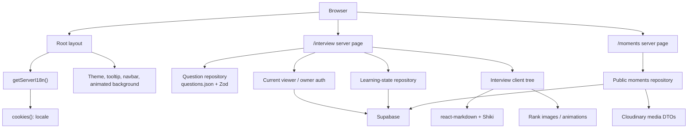

# Audit hiệu năng, tốc độ tải và tài nguyên

**Dự án:** vodinhquan.v1  
**Ngày đo:** 19/09/2026  
**Snapshot mã:** ffda776, cùng các thay đổi cục bộ có sẵn tại thời điểm audit. Các thay đổi cục bộ của người dùng không bị sửa.  
**Phạm vi:** tải trang công khai, cache/rendering, JavaScript phía trình duyệt, kích thước asset, dữ liệu Interview, Moments/Supabase, hiệu năng runtime và vệ sinh dependency.

## Kết luận điều hành

Ba nguồn lãng phí lớn nhất hiện tại là:

1. Toàn bộ trang App Router đang render động vì layout gốc đọc cookie locale. Build production đánh dấu mọi route là dynamic; trang công khai vì thế chưa tận dụng được static/CDN cache.
2. Trang Interview có thể tải hơn 8,8 MB SVG rank trực tiếp chỉ để hiển thị ảnh nhỏ. Toàn bộ tập asset rank là 25,49 MB; các SVG này chứa raster nhúng và đang tắt image optimization.
3. Code highlighting chạy trong Client Component bằng Shiki web bundle, trong khi blog và dữ liệu Interview đều là nội dung tin cậy có thể xử lý phía server/build.

Các vấn đề tiếp theo cần xử lý là danh sách Interview không phân trang, Moments luôn truy vấn Supabase không cache và không giới hạn, animation canvas chạy trên mọi route, và dependency tree có 2 advisory critical cùng 16 advisory high.

Không nên bắt đầu bằng tinh chỉnh vi mô. Thứ tự đem lại hiệu quả cao nhất là: cập nhật dependency an toàn, khôi phục chiến lược cache cho dữ liệu công khai, giảm asset rank/Shiki, rồi phân trang dữ liệu Interview và Moments.

## Trạng thái triển khai P0 — 24/09/2026

Đã hoàn tất:

- Nâng Next và eslint-config-next lên 16.3.6; sharp theo Next được nâng lên 0.35.4.
- Chuyển override và build-dependency allowlist từ package.json sang pnpm-workspace.yaml. Các override được giới hạn theo dependency chain để không ảnh hưởng js-yaml của ESLint.
- Cập nhật các dependency dễ bị ảnh hưởng trong lockfile: postcss 8.5.23, nanoid 3.3.18, browserslist 4.28.7, js-yaml 3.15.2 cho gray-matter và toml 4.2.0 cho remark-mdx-frontmatter.
- Thêm cache 5 phút cho Moment summaries và Moment detail công khai, với tag moments:public; mọi Moment server action giờ invalidation tag sau mutation thành công.
- Bỏ force-dynamic riêng ở route Moments. Route vẫn render động do cookie locale ở layout gốc, nhưng query Supabase công khai không còn chạy cho mỗi request cache hit.
- Mở rộng type input của learning-progress để snapshot cũ thiếu ignoredIds vẫn được validate/merge đúng; đây là lỗi type-check có sẵn bị Next mới phát hiện.

Xác minh sau triển khai:

- pnpm audit --prod: 0 advisory.
- pnpm lint, pnpm test (73 tests) và pnpm build với Node 24: pass.
- Smoke test production cho /moments: 200 ở hai lần tải; đo local giảm từ khoảng 126 ms xuống 17 ms ở lượt thứ hai. Cookie vi/en vẫn tạo HTML có lang đúng.

Chủ động chưa làm:

- Chưa chuyển locale từ cookie sang segment URL và static/ISR. Đây là thay đổi URL/SEO có phạm vi rộng; P0 hiện tại tách được data cache an toàn mà không thay đổi UX locale.
- Chưa bật Cache Components toàn cục. Cache hiện dùng unstable_cache tương thích với cấu hình hiện tại; có thể thay bằng use cache trong proof of concept riêng khi locale architecture đã sẵn sàng.

## Trạng thái triển khai P1 — 24/09/2026

Đã hoàn tất bốn hạng mục P1, giữ nguyên boundary dữ liệu server và không thêm dependency runtime mới.

### Rank và animation

- Thay 20 SVG rank chứa raster bằng 10 banner WebP versioned tại `public/ranked/v1`; `rank-meta` chỉ giữ một `imageSrc` cho mỗi tier. `RankImage` quay lại pipeline tối ưu của Next Image và khai báo `sizes` theo điểm hiển thị.
- Chỉ rank hiện tại xuất hiện ở first view. Phần tóm tắt/category dùng marker CSS-text nhẹ; `RankUpModal` được dynamic import và chỉ mount video của pha đang phát với `preload="metadata"`.
- Re-encode 20 video promotion còn được tham chiếu: 19.060.220 xuống 8.878.253 bytes (giảm 53,4%). Xóa 9 video emblem không có reference và 49 placeholder lỗi trong `public/rank-animation` sau inventory source.

| Vùng asset theo dõi bởi Git | Trước | Sau | Giảm |
| --- | ---: | ---: | ---: |
| `public/ranked` | 25.415.602 bytes | 943.588 bytes | 96,3% |
| `public/rank-animation` | 23.725.912 bytes | 10.092.268 bytes | 57,5% |
| Toàn bộ `public` | 70.685.177 bytes | 32.579.519 bytes | 53,9% |

Tổng 10 banner WebP là 222.218 bytes; mỗi lượt first view chỉ cần request asset của tier hiện tại, không phải toàn bộ manifest.

### Markdown và Shiki

- Blog dùng `codeToHtml` của Shiki trong Server Component; nút copy là client island riêng, không kéo Shiki vào bundle Blog ban đầu.
- Interview tách `react-markdown` và renderer code qua `lazy`/`Suspense`; Shiki client chỉ được dynamic import khi người dùng mở accordion có fenced code. Có fallback plain code trong lúc chunk tải.
- Thêm kiểm thử cho trường hợp `react-markdown` bọc phần tử code bằng component riêng; đây là điều kiện cần để fenced code ở Interview được highlight và hiển thị nút copy đúng.

### Interview phân trang phía server

- `getInterviewQuestionPage` lọc raw data ở server, cắt tối đa 24 record rồi mới map DTO question/answer. Không còn gửi 144 answer của category React xuống client.
- `page` là URL state; thay đổi category, subcategory, level, query hoặc target sẽ trở về trang 1. Số thứ tự card giữ đúng vị trí toàn bộ tập kết quả và flashcard chỉ dùng tập của trang hiện tại.
- Thêm điều khiển Previous/Next bằng Link/Button thật, có trạng thái disabled, nhãn điều hướng và `aria-live` cho số trang.

### Moments cursor feed

- Public feed dùng projection DTO rõ ràng, giới hạn 12 Moment cộng một record look-ahead và keyset cursor `(sort_key, id)`. Index chỉ truy vấn cover asset cần hiển thị, còn gallery đầy đủ vẫn thuộc detail.
- Cursor được Base64URL encode, validate timestamp/UUID trước khi tạo điều kiện Supabase. Migration index partial đã sẵn sàng ở `supabase/migrations/202609240001_moments_public_feed_cursor.sql`.
- Migration chưa được áp dụng vào Supabase remote trong P1; đó là bước deploy có kiểm soát riêng.

### Xác minh P1

| Kiểm tra | Kết quả thực tế |
| --- | --- |
| CodeGraph | `sync` hoàn tất 34 file thay đổi; index cập nhật: 244 files, 2.081 nodes, 3.574 edges |
| Static checks | `pnpm lint` pass; `pnpm test` pass với 33 files / 79 tests; `git diff --check` pass |
| Production | `pnpm build` với Node 24 và Next 16.3.6 pass; `pnpm audit --prod` không còn advisory |
| HTML Interview | Đo lại local `/interview?category=React`: 66.670 bytes gzip, giảm khoảng 34,9% từ baseline 102,4 KB gzip. Đây chỉ là HTML; JS route cần tiếp tục theo dõi bằng bundle budget CI |
| Interview pagination | `/interview?category=React` hiển thị 24 card, Page 1 of 6; trang kế tiếp bắt đầu tại câu #25 |
| Code rendering | Accordion CSS có fenced code được render với class Shiki và nút Copy; blog detail có 2 code block Shiki/copy từ Server Component |
| Moments | Feed production tải thành công với 3 bộ dữ liệu hiện có; dữ liệu local chưa đủ 12 record để hiển thị next cursor, còn encoding/filter cursor được phủ bằng unit test |

## Phương pháp và giới hạn đo

- CodeGraph đã được đồng bộ và dùng để truy vết luồng render, dữ liệu, auth và media: **234 files, 1.980 nodes, 3.471 edges**.
- Các truy vấn kiến trúc chính: codegraph sync, codegraph status, codegraph callees InterviewPage, codegraph impact getServerI18n --depth 3, và context search cho server rendering, locale, auth, question repository, media.
- Đã chạy build production bằng Node 24/pnpm 10.33, bundle analysis, lint và test. Build thành công; tất cả route App Router hiển thị ký hiệu dynamic.
- Các số byte và TTFB bên dưới là đo local ở chế độ production, không có CDN, không throttling mạng và không phải số liệu người dùng thực. Chúng phù hợp làm baseline để so sánh trước/sau, không phải SLA production.
- Các asset và source được kiểm tra trực tiếp. Audit gốc không thay đổi ứng dụng; các cập nhật P0/P1 ở trên là phần triển khai sau audit và có số liệu trước/sau riêng.

## Bản đồ kiến trúc từ CodeGraph

CodeGraph cho thấy getServerI18n tác động rộng tới layout gốc, home, blog, interview, moments, studio và metadata. Đây là điểm kiến trúc cần tách trước khi kỳ vọng cache route công khai.

## Baseline đã đo

| Route | HTML gzip | JS gzip | CSS gzip | RSC gzip | DOM nodes | Tổng HTML + JS + CSS |
| --- | ---: | ---: | ---: | ---: | ---: | ---: |
| / | 42,4 KB | 341,1 KB | 31,5 KB | 24,2 KB | — | 415,0 KB |
| /blog | 15,7 KB | 288,3 KB | 31,5 KB | 10,7 KB | — | 335,5 KB |
| /blog/[slug] | 16,5 KB | 344,8 KB | 31,5 KB | 10,5 KB | — | 392,8 KB |
| /interview (Next.js mặc định) | 87,6 KB | 510,9 KB | 31,5 KB | 43,9 KB | 1.963 | 630,0 KB |
| /interview?category=React | 102,4 KB | 510,9 KB | 31,5 KB | 49,8 KB | 2.932 | 644,8 KB |
| /moments | 14,2 KB | 295,8 KB | 31,5 KB | — | — | 341,5 KB |

Tổng trong cột cuối chưa gồm font, ảnh, SVG rank, request bên thứ ba và chunk chạy sau hydration. Vì vậy tải thực tế của Interview lớn hơn đáng kể. Trên đường dẫn React, trình duyệt render 144 accordion cards; thử nghiệm mobile 390 px vẫn không tràn ngang nhưng tạo gần 3.000 DOM nodes.

Một số kết quả định lượng khác:

- /moments có TTFB local cold khoảng 893 ms và warm khoảng 293 ms. Profile cho thấy request Supabase của moments lần đầu khoảng 707 ms.
- /interview local có TTFB thấp hơn, khoảng 126 ms cold và 20 ms warm, nhưng tải HTML/RSC và client work tăng theo số câu hỏi lọc được.
- src/features/interview-practice/data/questions.json có 2.470 câu hỏi, 57 category, dung lượng 5.495.861 bytes. Category React có 144 câu hỏi.
- Thư mục public có 153 files, 70.703.617 bytes (67,4 MiB). Riêng public/ranked là 25.490.992 bytes; public/rank-animation là 23.725.912 bytes.
- Cache phát triển .next hiện khoảng 5,0 GB. Đây là chi phí workstation/CI, không phải byte gửi cho người dùng.

## Điểm làm đúng cần giữ

- Question repository là server-only, validate raw JSON bằng Zod, và chỉ map view DTO trước khi truyền vào component. Raw JSON không bị import trực tiếp vào Client Component.
- Moments lấy asset theo lô cho danh sách moment, tránh mẫu N+1 query.
- Project card dùng Next Image cho ảnh lớn; ảnh nguồn lớn vẫn cần giảm nhưng trình duyệt hiện nhận biến thể tối ưu thay vì ảnh gốc.
- App đã có revalidatePath trong action của Moments. Điều này tạo nền tảng tốt để bổ sung cache tag/invalidation có kiểm soát.

## Phát hiện và hướng xử lý

### P0 — Dependency tree có lỗ hổng critical và cấu hình pnpm đang bị bỏ qua

**Bằng chứng**

- pnpm audit --prod báo 26 advisory: 2 critical, 16 high và 8 moderate.
- Next 16.2.9 có hai advisory critical; audit yêu cầu tối thiểu 16.3.3.
- Các dependency transitive dễ liên quan đến availability/image handling cũng cũ: sharp 0.34.5, js-yaml 3.14.2, nanoid 3.3.12, postcss 8.5.15, browserslist và toml.
- pnpm cảnh báo trường pnpm.overrides và pnpm.onlyBuiltDependencies trong package.json hiện không được đọc. Điều này làm cơ chế pin dependency kỳ vọng không có hiệu lực.

**Tác động**

Đây là blocker trước khi mở rộng image optimization hoặc chuyển đổi asset. Vulnerability ở Next Image Optimization có thể biến thao tác tối ưu AVIF thành rủi ro server; dependency tree không được pin đúng cũng làm build và hiệu năng khó tái lập.

**Triển khai đề xuất**

1. Cập nhật Next và eslint-config-next cùng release line tương thích lên ít nhất 16.3.3; sau đó cập nhật các dependency transitive bằng đường nâng cấp chính thức của content collections hoặc override có hiệu lực.
2. Chuyển cấu hình pnpm mà CLI báo bỏ qua sang vị trí cấu hình workspace mà phiên bản pnpm hiện tại hỗ trợ, regenerate lockfile và xác nhận override thực sự được áp dụng.
3. Chạy lại audit, build, test Image Optimization với ảnh Cloudinary và kiểm tra visual regression.
4. Thêm audit vào CI với policy: không chấp nhận critical; high cần có issue có thời hạn nếu chưa thể nâng ngay.

**Tiêu chí hoàn thành:** audit không còn critical; mọi override được CLI xác nhận là có hiệu lực; build/lint/test pass.

### P0 — Cookie locale trong root layout làm toàn bộ public route dynamic

**Bằng chứng**

- src/app/layout.tsx gọi getServerI18n trong cả generateMetadata và RootLayout.
- src/i18n/server.ts gọi cookies().
- Build production đánh dấu toàn bộ route App Router là dynamic. Header local của các route mẫu là private/no-store.
- src/app/moments/page.tsx và trang detail còn khai báo dynamic force-dynamic rõ ràng.

**Tác động**

Mỗi request công khai phải đi qua render server, tăng TTFB, số invocation và phụ thuộc vào Supabase. Cache CDN không thể hấp thụ lưu lượng đọc phổ biến. Điều này đặc biệt đắt cho Moments và các trang blog có nội dung ít thay đổi.

**Triển khai đề xuất**

1. Không thêm force-static vào root layout hiện tại: Next sẽ làm cookie trở thành giá trị rỗng, gây sai locale.
2. Ngắn hạn: cache riêng dữ liệu public không phụ thuộc cookie. Bọc getPublishedMomentSummaries và dữ liệu read-only phù hợp bằng unstable_cache, key/version rõ ràng, tag moments:public, TTL 60–300 giây. Action publish/edit/delete phải invalidation tag song song với revalidatePath.
3. Trung hạn: đánh giá route locale rõ ràng như /{locale}/..., generate static params cho vi/en và chỉ dùng cookie ở redirect/lựa chọn ban đầu. Khi đó layout public có thể static/ISR, còn auth/studio giữ dynamic.
4. Chỉ thử Cache Components/use cache trong một proof of concept cho public data. Không bật toàn cục trong cùng PR với tái cấu trúc locale/auth.

**Tiêu chí hoàn thành:** cache hit của public Moments không gọi Supabase; public page có cache-control phù hợp; locale và auth vẫn chính xác khi có/không có cookie.

### P1 — Asset rank tải quá lớn cho UI nhỏ

**Bằng chứng**

- src/features/interview-practice/components/rank-image.tsx dùng Next Image với unoptimized.
- Rank metadata tham chiếu 30 asset dưới public/ranked, tổng 25.490.992 bytes. Nhiều SVG thực chất chứa raster nhúng.
- Một lượt duyệt Interview đã tải bộ SVG rank với kích thước thô ít nhất khoảng 8,85 MB; các file không có cache immutable dài hạn.
- public/rank-animation bổ sung 23,73 MB video/animation vào artifact deploy.

**Tác động**

Đây là nguồn tải nặng nhất được quan sát. SVG vài trăm KB đến hơn 2 MB được dùng để hiển thị icon khoảng 48–96 px. Nó gây chậm LCP/INP trên mobile, tăng egress và làm deploy artifact lớn dù người dùng không mở modal rank.

**Triển khai đề xuất**

1. Tạo biến thể raster WebP/AVIF hoặc PNG đã nén cho từng rank ở 48, 64 và 96 px; không dùng SVG wrapper chứa ảnh bitmap.
2. Chỉ render/load rank hiện tại lúc first paint. Logo tier kế tiếp, animation và audio chỉ import/mount khi người dùng thực sự đạt mốc.
3. Dùng Next Image không unoptimized cho raster local hoặc Cloudinary named transformation nếu asset được chuyển sang CDN. Kiểm tra cache immutable bằng hash/version trong tên file.
4. Đặt preload=none cho video rank và giữ RankUpModal trong dynamic import.
5. Inventory và xoá sau khi xác nhận reference: các file placeholder lỗi trong public/rank-animation không có reference source; không xoá tự động trong phase audit.

**Tiêu chí hoàn thành:** asset rank của first view dưới 200 KB transfer, chỉ có active tier tải lúc đầu, animation không được tải trước khi modal mở.

### P1 — Shiki web bundle chạy trên client cho nội dung có thể render server-side

**Bằng chứng**

- src/components/mdx/code-block.tsx dynamic-import shiki/bundle/web trong useEffect.
- Bundle analysis cho thấy graph Shiki gồm ngôn ngữ, theme và Oniguruma lớn; browser đã tải một chunk Shiki khoảng 622 KB raw / 231 KB gzip trên route có code.
- Shiki công bố web preset khoảng 3,8 MB minified / 695 KB gzip bao gồm async chunks.
- Next cũng chỉ ra syntax highlighting/markdown transform là ví dụ điển hình nên chuyển về Server Component khi không cần browser API.

**Tác động**

Blog và Interview trả phí JavaScript, parse DOM và memory chỉ để sinh HTML code block. Vì QuestionList mount nhiều item, chi phí có thể tăng ngay cả khi accordion chưa được đọc.

**Triển khai đề xuất**

1. Blog: highlight lúc build/server bằng Shiki server integration; giữ nút Copy là Client Component nhỏ, nhận source code và HTML đã render.
2. Interview: phase đầu chỉ highlight markdown của trang câu hỏi hiện tại ở server. Nếu cần client-side, lazy-load khi accordion đang mở và dùng Shiki core/fine-grained bundle chỉ với ngôn ngữ thật sự dùng: tsx, typescript, javascript, json, bash, css, html, sql, plaintext, cùng hai theme.
3. Tách Markdown renderer và code block khỏi initial interactive shell; đo lại chunk sau mỗi phương án.

**Tiêu chí hoàn thành:** initial JS của blog/interview không chứa web preset Shiki; opening một answer vẫn render code đúng, copy và theme vẫn hoạt động.

### P1 — Interview gửi và render toàn bộ tập câu hỏi đã lọc

**Bằng chứng**

- Server page gọi getFilteredInterviewQuestions rồi truyền toàn bộ questions vào InterviewPracticePage.
- Repository áp dụng nhiều lần Array.filter trên toàn bộ 2.470 raw questions và map cả question lẫn answer cho mọi kết quả.
- QuestionList map tất cả questions thành AccordionItem. React có 144 câu hỏi, tạo HTML khoảng 818 KB raw, RSC khoảng 205 KB raw và 2.932 DOM nodes.

**Tác động**

Trang vẫn có thể dùng được ở hiện tại, nhưng payload, hydration, local learning state và Markdown work tăng tuyến tính với category/dataset. Khi ngân hàng câu hỏi tăng, đây sẽ là bottleneck chính của Interview.

**Triển khai đề xuất**

1. Bổ sung page và pageSize vào URL state. Mặc định 20–25 cards; server trả count, page metadata và chỉ Question DTO của page hiện tại.
2. Giữ filter/search ở server. Với flashcard, giới hạn deck hiện tại theo page hoặc thêm deck cursor rõ ràng; không gửi toàn bộ answer chỉ để người dùng xem một thẻ.
3. Chỉ tải answer/markdown khi accordion mở nếu phase phân trang vẫn chưa đủ. Dùng route handler/server action đọc một Question DTO đã validate và client cache theo question id.
4. Gộp loader viewer + learning state để owner path không lặp owner authorization/database lookup. Với khách public, không chạm dữ liệu owner.
5. Chỉ tối ưu index/in-memory taxonomy sau khi có profile mới; 2.470 items chưa cần database/search engine.

**Tiêu chí hoàn thành:** tối đa 25 accordion cards được render ban đầu; React filter không vượt mục tiêu transfer đã chốt; URL vẫn share được và flashcard không mất ngữ nghĩa học.

### P1 — Public Moments không cache, không pagination và dùng select(*)

**Bằng chứng**

- src/app/moments/page.tsx force dynamic.
- src/features/moments/lib/moment-repository.ts lấy tất cả moments public bằng select(*), sau đó lấy tất cả media asset bằng select(*) và in(moment_id, ids).
- Cách làm hiện tại tránh N+1 nhưng hai query sẽ tăng không giới hạn cùng số Moment và số asset.
- Cold request đến Supabase là nguồn chính của TTFB local.

**Tác động**

Moment feed sẽ chậm dần theo dữ liệu, gửi fields không cần cho index view, và khiến mọi lượt xem phụ thuộc trực tiếp vào Supabase.

**Triển khai đề xuất**

1. Thay select(*) bằng projection DTO cho index: slug, title, summary, published/sort key, cover URL/metadata cần hiển thị.
2. Thêm cursor pagination theo (sort_key, id), kích thước 12 hoặc 24. Chỉ lấy cover asset ở index; load gallery đầy đủ ở detail.
3. Cache public feed/detail theo tag và TTL. Publish/edit/delete phải revalidate tag; owner/studio query không cache chung với public data.
4. Dùng profile/query plan của Supabase sau khi dataset lớn để kiểm tra index thực tế; không thay thế truy vấn batch bằng N+1.

**Tiêu chí hoàn thành:** index query có limit và projection rõ ràng; cache hit không gọi Supabase; detail chỉ lấy asset của một moment.

### P2 — Upload/cleanup media làm tăng latency và storage theo thời gian

**Bằng chứng**

- MomentUploadPanel upload từng file tuần tự: Cloudinary upload xong mới insert asset rồi mới chuyển file tiếp theo.
- Delete action chỉ xoá record Supabase; không có Cloudinary destroy trong luồng hiện tại.
- Input chỉ giới hạn accept=image/* ở client; cần enforcement server/provider độc lập.

**Tác động**

Upload nhiều ảnh chậm hơn cần thiết; thao tác xoá có thể để lại orphan trong Cloudinary, làm storage/cost tăng dần.

**Triển khai đề xuất**

1. Giới hạn server-signed upload theo mime type, số file và byte; kiểm tra lại payload Cloudinary ở server.
2. Upload concurrency có giới hạn 2–3 file, progress từng file và retry có idempotency; không mở Promise.all vô hạn.
3. Lưu public_id/asset id rõ ràng; khi delete, enqueue destroy Cloudinary có retry/outbox để không mất DB consistency.
4. Sinh thumbnail/cover transformation khi upload hoặc qua named transformation; index view chỉ dùng derivative đúng kích thước.

**Tiêu chí hoàn thành:** upload nhiều file có concurrency bounded; asset DB xoá thành công sẽ được cleanup provider có retry/audit trail; feed không dùng original full-size.

### P2 — Animation canvas chạy trên mọi route và chưa tôn trọng reduced motion đầy đủ

**Bằng chứng**

- Root layout luôn render BackgroundGrid.
- BackgroundGrid dynamic-import FlickeringGrid với square size 2/gap 2.
- FlickeringGrid dùng requestAnimationFrame, update + draw từng ô canvas trong khi visible; canvas được quan sát có backing size khoảng 2.560 × 400 ở DPR 2.
- CSS hiện chỉ tắt blur-fade khi prefers-reduced-motion; FlickeringGrid không có nhánh reduced-motion/page-visibility.

**Tác động**

Mọi trang giữ một animation canvas chạy liên tục ở phần đầu trang, gây CPU/GPU/battery pressure và cạnh tranh main thread với hydration/interaction, đặc biệt trên mobile.

**Triển khai đề xuất**

1. Thay background global bằng CSS gradient/static grid cho đa số route. Chỉ bật hiệu ứng động ở home nếu nó đóng góp rõ ràng cho brand.
2. Nếu giữ canvas: tôn trọng prefers-reduced-motion bằng cách không mount, pause khi tab hidden, giới hạn DPR, giảm số cell và throttle khoảng 12 fps.
3. Tách visual enhancement bằng dynamic import sau interactive content; đo INP trước/sau trên mobile.

**Tiêu chí hoàn thành:** reduced-motion không tạo animation loop; route nội dung không chạy canvas vô hạn; không có regression visual đáng kể.

### P2 — Kích thước artifact và dependency client cần guardrail

**Bằng chứng**

- public là 67,4 MiB, trong đó project originals như qrtable.png và kick.png rất lớn. Next Image giảm bytes gửi khi render card, nhưng source gốc vẫn tăng repository/deploy/cold transform cost.
- Một số icon kỹ năng lấy trực tiếp từ cdn.simpleicons.org, tạo request bên thứ ba ngoài critical origin.
- Motion, markdown và visual components đi qua global/client boundaries; bundle analysis cần được giữ trong workflow chứ không chỉ chạy khi audit.

**Triển khai đề xuất**

1. Chuẩn hoá ảnh nguồn: giới hạn dimension, nén bản canonical, giữ metadata asset inventory. Không upload ảnh 8–10 MB khi card chỉ cần khoảng 1.200 px.
2. Self-host các SVG icon nhỏ, hoặc dùng registry icon hiện có; tránh CDN bên thứ ba cho icon 16–24 px.
3. Thêm bundle budget cho route và review lớn module graph trong CI. Chỉ cân nhắc optimizePackageImports sau khi analyzer chỉ ra package export fan-out thực tế.
4. Đặt policy cache cleanup cho .next trên workstation/CI; không xem nó là vấn đề tải người dùng.

## P2 — Kết quả triển khai (2026-09-25)

### Upload, cleanup và delivery Moments

- Signed upload chỉ cho phép AVIF, JPEG, PNG và WebP. Client chặn file quá 10 MB hoặc quá 12 file mỗi lượt; server đọc lại metadata từ Cloudinary trước khi ghi DB, nên không tin `bytes`, format hay URL do browser gửi lên.
- Upload chạy tối đa 3 file song song, có retry và trạng thái từng file. Persist asset được thực hiện theo thứ tự để giữ `sort_order`; retry persist dùng cùng `public_id` và action xử lý idempotent.
- Migration `202609250001_moments_media_cleanup_outbox.sql` thêm outbox cleanup. Xóa Moment/asset sẽ enqueue Cloudinary destroy trong cùng transaction DB; worker nội bộ claim job, retry exponential tối đa 6 lần và lưu lỗi/audit trail.
- Feed/detail tạo URL Cloudinary `f_auto,q_auto,c_limit,w_<width>` để không trả original full-size cho card/cover.

### Visual runtime và artifact

- Giữ nguyên `FlickeringGrid` của Magic UI ở `BackgroundGrid` và Contact, gồm mật độ `squareSize=2`/`gridGap=2`, hiệu ứng canvas trên mọi route và visual icon source hiện có. Không loại bỏ hoặc thay thế component visual đã được chọn cho public UI.
- Bổ sung safeguard bên trong component: canvas vẽ một frame tĩnh khi người dùng bật reduced motion hoặc tab bị ẩn, và chỉ giữ animation loop khi component/page đang visible. Các giá trị mặc định vẫn giữ DPR thiết bị và 60 fps để không làm thay đổi trải nghiệm gốc.
- Bốn ảnh project được chuyển sang WebP, giới hạn cạnh dài 1.600 px; bản PNG/JPEG gốc đã bị xóa sau kiểm tra giao diện. Kích thước `public/` giảm từ khoảng 31–32 MiB trước hạng mục này xuống **12,44 MiB**.
- CI/local quality gate có `check:assets` (tổng `public/` tối đa 16 MiB, một asset tối đa 2 MiB) và `check:bundles` cho `/`, `/blog`, `/interview`, `/moments`.

### Kết quả đo tại build production

| Route | Client chunks đo được | Budget |
| --- | ---: | ---: |
| `/` | 477,7 KiB | 1.220,7 KiB |
| `/blog` | 316,5 KiB | 1.220,7 KiB |
| `/interview` | 774,5 KiB | 1.464,8 KiB |
| `/moments` | 337,7 KiB | 1.220,7 KiB |

`pnpm quality` chạy với Node 24 đã pass: lint, 92 tests, production build, asset/bundle budgets và `pnpm audit --prod` không còn advisory.

### Bước vận hành còn lại trước khi lên production

1. Apply migration outbox vào Supabase production.
2. Đặt `SUPABASE_SERVICE_ROLE_KEY` và `MEDIA_CLEANUP_SECRET` trong hosting; secret sau phải dài ít nhất 32 ký tự.
3. Đặt GitHub Actions secrets `MEDIA_CLEANUP_URL` (domain production, không có slash cuối) và `MEDIA_CLEANUP_SECRET`, rồi chạy workflow một lần để xác minh cleanup end-to-end. Chưa thực hiện các thao tác này trong workspace hiện tại.

## Lộ trình triển khai đề xuất

| Pha | Phạm vi | Độ lớn | Deliverable có thể review |
| --- | --- | --- | --- |
| 0 | Dependency security và pnpm config | S | Next/lockfile cập nhật, audit sạch critical, CI policy |
| 1 | Baseline/RUM/CI budget | S | Web Vitals client capture, Lighthouse CI, báo cáo bundle có version |
| 2 | Cache public + Moments | M | Cached public repository, tag invalidation, cursor feed và DTO projection |
| 3 | Asset rank và media derivatives | M | Asset manifest mới, lazy RankUpModal, xóa/di trú asset sau inventory |
| 4 | Shiki server-side và client boundary | M | Blog/interview code rendering không mang web preset ở initial JS |
| 5 | Interview pagination/deferred answer | M | URL page state, max 25 cards, flashcard deck semantics, loader auth hợp nhất |
| 6 | Visual runtime cleanup | S | Static/reduced-motion background, mobile INP comparison |

Pha 0 nên được merge độc lập. Pha 2 và 3 có thể triển khai song song sau khi baseline đã được lưu. Pha 4 và 5 cần đo lại sau mỗi PR vì chúng cùng tác động payload Interview.

## Công nghệ nên dùng, chỉ khi cần

| Nhu cầu | Lựa chọn | Quyết định |
| --- | --- | --- |
| Cache public DB/data function | Next unstable_cache + revalidateTag; thử use cache trong POC | Không cần thêm library ngay |
| Static/ISR locale | Route locale rõ ràng, generateStaticParams | Cần quyết định UX URL trước |
| Highlight code | Shiki server-side hoặc Shiki core fine-grained | Đã có Shiki; không cần web preset ở browser |
| Image derivative | Cloudinary named transformations hoặc pipeline Sharp sau khi update | Tận dụng hạ tầng hiện có |
| RUM | useReportWebVitals gửi endpoint riêng; hoặc Vercel Speed Insights nếu hạ tầng là Vercel | Chọn một nguồn sự thật, tránh hai SDK tracking |
| Regression lab | Lighthouse CI | Dev dependency/CI-only, không vào runtime |
| Virtualization | Không thêm ở phase đầu | Ưu tiên server pagination; chỉ dùng react-virtual nếu profiling vẫn cho thấy cần |

## Guardrail và mục tiêu sau triển khai

Các mục tiêu này là acceptance criteria cho PR tối ưu, không phải kết quả đã đạt trong audit:

- Core Web Vitals p75 theo mobile/desktop: LCP ≤ 2,5 s, INP ≤ 200 ms, CLS ≤ 0,1.
- /interview?category=React: tối đa 25 accordion cards initial; HTML + JS + CSS baseline mới giảm ít nhất 35% so với 644,8 KB gzip hiện tại, trước khi tính asset rank.
- Rank first view: không tải toàn bộ tier; tổng transfer asset rank initial < 200 KB.
- /moments: cache hit không gọi Supabase; index có cursor + limit; query chỉ lấy field cho card.
- No critical dependency advisory; high advisory phải có kế hoạch remediation được ghi nhận.
- Lighthouse CI cover /, /blog, một blog detail, /interview, /moments trên mobile profile và fail khi vượt ngân sách đã chốt.

## Xác minh đã chạy

| Kiểm tra | Kết quả thực tế |
| --- | --- |
| CodeGraph sync/status | Pass — index up to date, 234 files / 1.980 nodes / 3.471 edges |
| Production build Node 24 | Pass — Next 16.2.9 build thành công, toàn bộ route App Router dynamic |
| Bundle analysis | Pass — xác định Shiki, client tree và asset pressure |
| pnpm lint | Pass |
| pnpm test | Pass — 73 tests |
| pnpm audit --prod | Fail theo policy — 2 critical, 16 high, 8 moderate |

## Điều chưa làm trong audit này

- Không bật static rendering/global Cache Components để tránh làm hỏng locale từ cookie.
- Không đổi raw question JSON sang Client Component; boundary server-only hiện tại cần giữ.
- Không xoá asset public, thay đổi Cloudinary hoặc nâng package. Báo cáo chỉ tạo kế hoạch có thể review trước khi thực thi.

## Tài liệu tham chiếu

- [Next.js — Caching and Revalidating](https://nextjs.org/docs/app/guides/caching-without-cache-components)
- [Next.js — Package Bundling](https://nextjs.org/docs/app/guides/package-bundling)
- [Shiki — Bundles và fine-grained bundle](https://shiki.style/guide/bundles)
- [web.dev — Core Web Vitals và ngưỡng p75](https://web.dev/articles/vitals)
